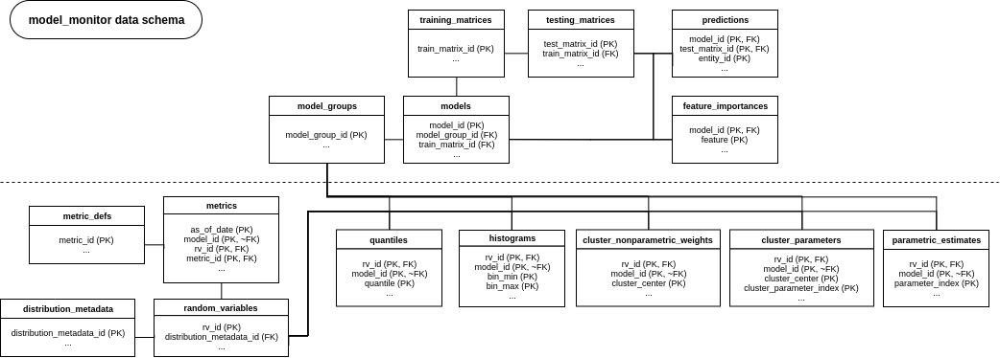

.. _index-data-schemas:

Data Schemas
===============

.. toctree::
   :maxdepth: 1
   :caption: Contents:
   :glob:

   *

This section documents the ``model_monitor`` data schema, including requirements for input data and the format of the
output data. The documentation here only specifies the schema requirements; for more information about the schema
design choices and use cases, please consult the :download:`white paper <../../white_paper/mm_white_paper.pdf>`

