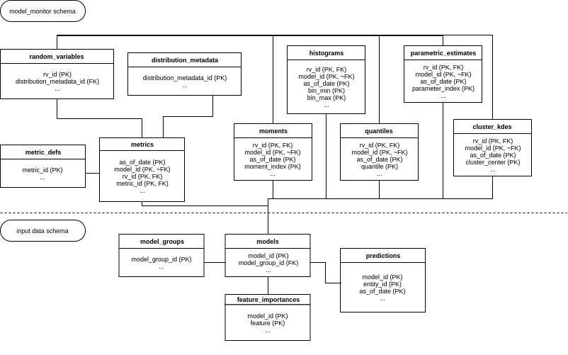

``model_monitor`` schema definition, with table and column descriptions.

``distribution_metadata``:

Each row defines behavior for characterizing a distribution's CDF, including preprocessing settings,
distribution fitting hyperparameters, and flagged warnings.

.. table::

    +--------------------------------+-----+-----------------------------------------------------------------------+--------+-----------+
    |              name              |dtype|                              description                              |nullable|constraints|
    +================================+=====+=======================================================================+========+===========+
    |distribution_metadata_id        |int  |distribution metadata unique identifier                                |False   |PK         |
    +--------------------------------+-----+-----------------------------------------------------------------------+--------+-----------+
    |default_type                    |text |default Python (numpy) data type                                       |True    |           |
    +--------------------------------+-----+-----------------------------------------------------------------------+--------+-----------+
    |default_value                   |text |default distribution value                                             |True    |           |
    +--------------------------------+-----+-----------------------------------------------------------------------+--------+-----------+
    |use_default_value_on_unsafe_cast|bool |if true, replace failed casts with default value                       |True    |           |
    +--------------------------------+-----+-----------------------------------------------------------------------+--------+-----------+
    |is_online                       |bool |indicator for online distribution                                      |True    |           |
    +--------------------------------+-----+-----------------------------------------------------------------------+--------+-----------+
    |warn_on_online_support_change   |bool |if true and support changes between online updates, raise warning      |True    |           |
    +--------------------------------+-----+-----------------------------------------------------------------------+--------+-----------+
    |is_discrete                     |bool |indicator for discrete distribution                                    |False   |           |
    +--------------------------------+-----+-----------------------------------------------------------------------+--------+-----------+
    |support_maximum                 |float|support maximum value                                                  |True    |           |
    +--------------------------------+-----+-----------------------------------------------------------------------+--------+-----------+
    |support_minimum                 |float|support minimum value                                                  |True    |           |
    +--------------------------------+-----+-----------------------------------------------------------------------+--------+-----------+
    |remove_samples_out_of_support   |bool |if true, exclude values from unspecified support                       |True    |           |
    +--------------------------------+-----+-----------------------------------------------------------------------+--------+-----------+
    |is_nullable                     |bool |column nullability                                                     |False   |           |
    +--------------------------------+-----+-----------------------------------------------------------------------+--------+-----------+
    |tracking_mode                   |text |if true, dynamically track quantile estimates for distribution         |False   |           |
    +--------------------------------+-----+-----------------------------------------------------------------------+--------+-----------+
    |n_quantiles                     |int  |number of evenly-spaced quantiles to specify                           |True    |           |
    +--------------------------------+-----+-----------------------------------------------------------------------+--------+-----------+
    |n_lower_tail_quantiles          |int  |number of lower tail quantiles to include, up to 10^-n                 |True    |           |
    +--------------------------------+-----+-----------------------------------------------------------------------+--------+-----------+
    |n_upper_tail_quantiles          |int  |number of upper tail quantiles to include, up to 1 - 10^-n             |True    |           |
    +--------------------------------+-----+-----------------------------------------------------------------------+--------+-----------+
    |custom_quantiles                |text |comma-delimited list of custom quantiles                               |True    |           |
    +--------------------------------+-----+-----------------------------------------------------------------------+--------+-----------+
    |histogram_min                   |float|smallest bin value                                                     |True    |           |
    +--------------------------------+-----+-----------------------------------------------------------------------+--------+-----------+
    |histogram_max                   |float|largest bin value                                                      |True    |           |
    +--------------------------------+-----+-----------------------------------------------------------------------+--------+-----------+
    |left_inclusive                  |bool |if true, bins are inclusive of their left values                       |True    |           |
    +--------------------------------+-----+-----------------------------------------------------------------------+--------+-----------+
    |count_outside_range             |bool |if true, all values outside range are counted, else classified as null |True    |           |
    +--------------------------------+-----+-----------------------------------------------------------------------+--------+-----------+
    |n_histogram_bins                |int  |number of evenly spaced histogram bins to use                          |True    |           |
    +--------------------------------+-----+-----------------------------------------------------------------------+--------+-----------+
    |custom_histogram_bins           |text |comma-delimited list of custom histogram bins                          |True    |           |
    +--------------------------------+-----+-----------------------------------------------------------------------+--------+-----------+
    |n_clusters                      |int  |number of clusters to characterize; if null, inferred from distribution|True    |           |
    +--------------------------------+-----+-----------------------------------------------------------------------+--------+-----------+
    |clustering_algorithm            |text |clustering algorithm name                                              |True    |           |
    +--------------------------------+-----+-----------------------------------------------------------------------+--------+-----------+
    |clustering_algorithm_kwargs     |jsonb|clustering algorithm kwargs                                            |True    |           |
    +--------------------------------+-----+-----------------------------------------------------------------------+--------+-----------+
    |parametric_family               |text |parametric family name                                                 |True    |           |
    +--------------------------------+-----+-----------------------------------------------------------------------+--------+-----------+

``random_variables``:

Each row defines a random variable and the metadata necessary to process it, including the distribution metadata,
the source table, and information about latent variable relationships.

.. table::

    +------------------------+-----+--------------------------------------------------+--------+-----------+
    |          name          |dtype|                   description                    |nullable|constraints|
    +========================+=====+==================================================+========+===========+
    |rv_id                   |int  |random variable ID, unique indentifier            |False   |PK         |
    +------------------------+-----+--------------------------------------------------+--------+-----------+
    |rv_name                 |text |random variable name                              |False   |unique     |
    +------------------------+-----+--------------------------------------------------+--------+-----------+
    |rv_type                 |text |random variable type                              |False   |           |
    +------------------------+-----+--------------------------------------------------+--------+-----------+
    |distribution_metadata_id|int  |distribution_metadata_id                          |True    |           |
    +------------------------+-----+--------------------------------------------------+--------+-----------+
    |source_table            |text |feature source table                              |True    |           |
    +------------------------+-----+--------------------------------------------------+--------+-----------+
    |latent_variable_name    |int  |observed feature (independent of calculation type)|False   |           |
    +------------------------+-----+--------------------------------------------------+--------+-----------+
    |agg_func                |text |aggregation function used to generate feature     |False   |           |
    +------------------------+-----+--------------------------------------------------+--------+-----------+
    |time_agg                |text |time interval (in postgresql interval format)     |False   |           |
    +------------------------+-----+--------------------------------------------------+--------+-----------+

``moments``:

Each row defines, for a given RV, date, and model, a moment calculation.

.. table::

    +------------+---------+-----------------------------+--------+-----------+
    |    name    |  dtype  |         description         |nullable|constraints|
    +============+=========+=============================+========+===========+
    |rv_id       |int      |random variable ID           |False   |PK, FK     |
    +------------+---------+-----------------------------+--------+-----------+
    |model_id    |int      |model ID                     |False   |PK, ~FK    |
    +------------+---------+-----------------------------+--------+-----------+
    |as_of_date  |timestamp|latest model monitor update  |False   |PK         |
    +------------+---------+-----------------------------+--------+-----------+
    |moment_index|int      |index representing ith moment|False   |PK         |
    +------------+---------+-----------------------------+--------+-----------+
    |moment_value|float    |moment value                 |True    |           |
    +------------+---------+-----------------------------+--------+-----------+

``quantiles``:

Each row defines, for a given RV, date, and model, a moment calculation.

.. table::

    +--------------+---------+---------------------------------------+--------+-----------+
    |     name     |  dtype  |              description              |nullable|constraints|
    +==============+=========+=======================================+========+===========+
    |rv_id         |int      |random variable ID                     |False   |PK, FK     |
    +--------------+---------+---------------------------------------+--------+-----------+
    |model_id      |int      |model ID                               |False   |PK, ~FK    |
    +--------------+---------+---------------------------------------+--------+-----------+
    |as_of_date    |timestamp|latest model monitor update            |False   |PK         |
    +--------------+---------+---------------------------------------+--------+-----------+
    |quantile      |float    |quantile, defined from [0, 1] inclusive|False   |PK         |
    +--------------+---------+---------------------------------------+--------+-----------+
    |quantile_value|float    |quantile value                         |True    |           |
    +--------------+---------+---------------------------------------+--------+-----------+

``histograms``:

Each row defines, for a given RV, date, and model, a fixed histogram window frequency.

.. table::

    +---------------+---------+--------------------------------+--------+-----------+
    |     name      |  dtype  |          description           |nullable|constraints|
    +===============+=========+================================+========+===========+
    |rv_id          |int      |random variable ID              |False   |PK, FK     |
    +---------------+---------+--------------------------------+--------+-----------+
    |model_id       |int      |model ID                        |False   |PK, ~FK    |
    +---------------+---------+--------------------------------+--------+-----------+
    |as_of_date     |timestamp|latest model monitor update     |False   |PK         |
    +---------------+---------+--------------------------------+--------+-----------+
    |bin_min        |float    |bin minimum                     |False   |PK         |
    +---------------+---------+--------------------------------+--------+-----------+
    |bin_max        |float    |bin maximum                     |False   |PK         |
    +---------------+---------+--------------------------------+--------+-----------+
    |value_count    |int      |count of values in given bin    |True    |           |
    +---------------+---------+--------------------------------+--------+-----------+
    |value_frequency|float    |frequency of values in given bin|True    |           |
    +---------------+---------+--------------------------------+--------+-----------+

``cluster_kdes``:

Each row defines, for a given RV, date, and model, a characterization of a single cluster in the distribution.

.. table::

    +-----------------+---------+---------------------------+--------+-----------+
    |      name       |  dtype  |        description        |nullable|constraints|
    +=================+=========+===========================+========+===========+
    |rv_id            |int      |random variable ID         |False   |PK, FK     |
    +-----------------+---------+---------------------------+--------+-----------+
    |model_id         |int      |model ID                   |False   |PK, ~FK    |
    +-----------------+---------+---------------------------+--------+-----------+
    |as_of_date       |timestamp|latest model monitor update|False   |PK         |
    +-----------------+---------+---------------------------+--------+-----------+
    |cluster_center   |float    |cluster center             |False   |PK         |
    +-----------------+---------+---------------------------+--------+-----------+
    |cluster_parameter|float    |cluster parameter          |False   |           |
    +-----------------+---------+---------------------------+--------+-----------+

``parametric_estimates``:

Each row defines, for a given RV, date, and model, a numerical estimate of given parameters from
a known statistical distribution.

.. table::

    +---------------+---------+---------------------------+--------+-----------+
    |     name      |  dtype  |        description        |nullable|constraints|
    +===============+=========+===========================+========+===========+
    |rv_id          |int      |random variable ID         |False   |PK, FK     |
    +---------------+---------+---------------------------+--------+-----------+
    |model_id       |int      |model ID                   |False   |PK, ~FK    |
    +---------------+---------+---------------------------+--------+-----------+
    |as_of_date     |timestamp|latest model monitor update|False   |PK         |
    +---------------+---------+---------------------------+--------+-----------+
    |parameter_index|int      |argument index of parameter|False   |PK         |
    +---------------+---------+---------------------------+--------+-----------+
    |parameter_value|float    |parameter value            |False   |           |
    +---------------+---------+---------------------------+--------+-----------+

``metric_defs``:

Each row defines a single metric calculation, including the name, comparison interval, and subset arguments.

.. table::

    +----------------+--------+-----------------------------------+--------+-----------+
    |      name      | dtype  |            description            |nullable|constraints|
    +================+========+===================================+========+===========+
    |metric_id       |int     |metric definition ID               |False   |PK         |
    +----------------+--------+-----------------------------------+--------+-----------+
    |metric_calc_name|text    |metric calc name                   |False   |           |
    +----------------+--------+-----------------------------------+--------+-----------+
    |compare_interval|interval|comparison interval                |False   |           |
    +----------------+--------+-----------------------------------+--------+-----------+
    |subset_name     |text    |subset name, as specified in config|False   |           |
    +----------------+--------+-----------------------------------+--------+-----------+
    |subset_args     |jsonb   |subset filter arguments            |True    |           |
    +----------------+--------+-----------------------------------+--------+-----------+

``metrics``:

Each row defines the result of a metric calculation given a date, model, random variable, and metric definition.

.. table::

    +------------+---------+---------------------------+--------+-----------+
    |    name    |  dtype  |        description        |nullable|constraints|
    +============+=========+===========================+========+===========+
    |as_of_date  |timestamp|latest model monitor update|False   |PK         |
    +------------+---------+---------------------------+--------+-----------+
    |model_id    |int      |model ID                   |False   |PK, ~FK    |
    +------------+---------+---------------------------+--------+-----------+
    |rv_id       |int      |random variable ID         |False   |PK, FK     |
    +------------+---------+---------------------------+--------+-----------+
    |metric_id   |int      |metric definition ID       |False   |PK, FK     |
    +------------+---------+---------------------------+--------+-----------+
    |metric_value|float    |metric value               |False   |           |
    +------------+---------+---------------------------+--------+-----------+

